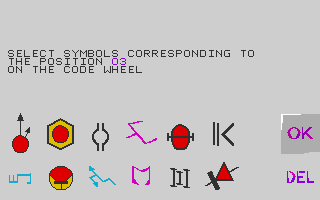

# Another World Amiga/DOS Technical notes

This document lists differences found in the Amiga and DOS executables and bytecode of Another World.

## Game Copy Protection

To prevent piracy, the game was bundled with a code wheel.

The player has to lookup the randomized symbols everytime the game starts.



After checking the symbols entered are the correct ones, a few variables are set and checked during gameplay.

This was probably added to defeat game cracks that would simply bypass the game protection screen.

The Amiga version bytecode checks 4 variables :

```
0081: VAR(0xBC) &= 16
0085: VAR(0xF8) = VAR(0xC6)
0088: VAR(0xF8) &= 128
008C: jmpIf(VAR(0xBC) == 0, @00A6)
0092: jmpIf(VAR(0xF8) == 0, @00A6)
0098: jmpIf(VAR(0xF2) != 6000, @00A6)
009F: jmpIf(VAR(0xDC) != 33, @00A6)
```

The DOS version bytecode checks 5 variables :

```
00B7: (14) VAR(0xBC) &= 16
00BB: (01) VAR(0xF8) = VAR(0xC6)
00BE: (14) VAR(0xF8) &= 128
00C2: (0A) jmpIf(VAR(0xBC) == 0, @00E9)
00C8: (0A) jmpIf(VAR(0xF8) == 0, @00E9)
00CE: (01) VAR(0xF8) = VAR(0xE4)
00D1: (14) VAR(0xF8) &= 60
00D5: (0A) jmpIf(VAR(0xF8) != 20, @00E9)
00DB: (0A) jmpIf(VAR(0xF2) != 4000, @00E9)
00E2: (0A) jmpIf(VAR(0xDC) != 33, @00E9)
```

The variables 0xBC, 0xC6 and 0xF2 are set by the bytecode when the symbols match.

The variables 0xDC and 0xE4 are set by the engine code.
0xE4 is initialized to 20.
0xDC is set when the protection part successfully exits.

```
_vars[0xE4] = 20;
...
if (_part == 16000 && _vars[0x67] == 1) {
  _vars[0xDC] = 33;
}
```

Interchanging the Amiga and DOS bytecode with another interpreter would require patching the bytecode or the executable.


## Game Code

The game code is split in 9 different sections.

Part  | Name  | Comment
----- | ----- | -------
16000 |       | protection screen
16001 | intro |
16002 | eau   |
16003 | pri   |
16004 | cite  |
16005 | arene |
16006 | luxe  |
16007 | final |
16008 |       | password screen

Each section can be used as a starting point by the engine, with _vars[0] set to start at a specific position within that section.


The password screen bytecode contains series of checks such as below to lookup the code entered.

```
08B6: (0A) jmpIf(VAR(0x1E) != 21, @08D8)
08BC: (0A) jmpIf(VAR(0x1F) != 15, @08D8)
08C2: (0A) jmpIf(VAR(0x20) != 14, @08D8)
08C8: (0A) jmpIf(VAR(0x21) != 20, @08D8)
08CE: (00) VAR(0x00) = 60
08D2: (19) updateResources(res=16006)
```

## Variables

The engine communicates with the game bytecode through special variables.

### 0x3C

The variable 0x3C contains a random value set on engine initialization.
The random seed is only used as part of the copy protection screen to randomize the symbols.

On Amiga, this variable is initialized with [VHPOSR](http://amiga-dev.wikidot.com/hardware:vhposr).

```
0B4E    movea.l (_vars).l,a0
0B54    move.w  ($DFF006).l,$78(a0)
```

On DOS, the value is read from the BIOS timer.

```
seg000:180D    mov ax, 40h
seg000:1810    mov es, ax
seg000:1812    mov di, 6Ch
seg000:1815    mov ax, es:[di]
seg000:1818    xchg ah, al
seg000:181A    add al, bl
seg000:181C    adc ah, bh
seg000:1820    mov ds:_vars+78h, ax
```

### 0x54

The game title was different when commercialized in the United States.

The "Out of This World" and "Interplay" screens can be toggled by setting bit 7 in the variable 0x54.

 
```
0084: (0A) jmpIf(VAR(0x54) < 128, @00C4)
008A: (0E) fillPage(page=255, color=0)
008D: (0B) setPalette(num=0)
0090: (19) updateResources(res=18)
0093: (0D) selectPage(page=0)
```

### 0xE5

The Amiga bytecode maps both `jump` and `up` to the same button (0xFB).

The DOS bytecode relies on the variable 0xE5 for the jump action.


## Opcodes Dispatch

The Amiga executable dispatches the opcodes with a sequence of 'if/else if' checks.

The order roughly corresponds to the frequency of the opcodes found in the game code.


```
0162    clr.l   d0
0164    move.b  (a0)+,d0
0166    btst    #7,d0
016A    bne.w   loc_25C ; DrawShape1
016E    btst    #6,d0
0172    bne.w   loc_296 ; DrawShape2
0176    cmp.b   #$A,d0
017A    beq.w   loc_418 ; op_condJmp
017E    cmp.b   #0,d0
0182    beq.w   loc_344 ; op_movConst
0186    cmp.b   #1,d0
018A    beq.w   loc_35E ; op_mov
018E    cmp.b   #2,d0
0192    beq.w   loc_37A ; op_add
...
0246    cmp.b   #$1A,d0
024A    beq.w   loc_638 ; op_playMusic
```

The DOS executable relies on a jump table.

```
seg000:1ABF    xor ah, ah
seg000:1AC1    mov al, es:[di]
seg000:1AC4    inc di
seg000:1AC5    test al, 80h
seg000:1AC7    jnz loc_0_11AE4 ; DrawShape1
seg000:1AC9    test al, 40h
seg000:1ACB    jnz loc_0_11B27 ; DrawShape2
seg000:1ACD    cmp al, 0
seg000:1ACF    jl loc_0_11ADD ; Invalid opcode
seg000:1AD1    cmp al, 1Ah
seg000:1AD3    jg loc_0_11ADD ; Invalid opcode
seg000:1AD5    shl ax, 1
seg000:1AD7    mov bx, ax
seg000:1AD9    jmp ds:_op_table[bx] ; opcodes jump table
```
